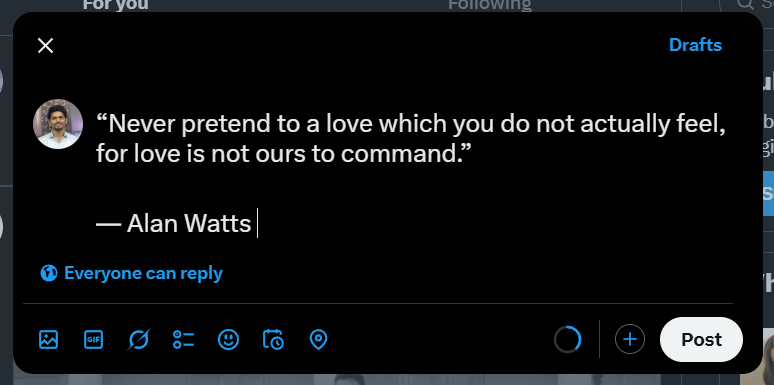

Random Quote Generator version 1

Overview

This is a simple Random Quote Generator that fetches and displays inspirational quotes along with a random background image. Users can copy quotes to the clipboard, share them on Twitter, and even download the quote as an image.

Features

- Fetches a random quote from an API.
- Displays quotes with a random background image.
- Allows users to copy the quote to the clipboard.
- Enables sharing the quote on Twitter.
- Provides an option to download the quote as an image.
- Includes a loading state for fetching new quotes.

Technologies Used

- HTML, CSS, JavaScript
- API Fetching: Uses `fetch` to retrieve quotes from `https://api.freeapi.app/api/v1/public/quotes/quote/random`.
- Random Image Background: Selects a random background image from a predefined list.
- Clipboard API: Copies the quote text.
- Twitter Intent API: Shares the quote on Twitter.
- html2canvas: Converts the quote card into an image for downloading.
- Font Awesome: Used for icons.

Installation & Usage

1. Clone the Repository

```sh
  git clone https://github.com/yourusername/random-quote-generator.git
  cd random-quote-generator
```

2. Open the `index.html` file in a browser

You can simply double-click on `index.html` or open it with a live server if using VS Code.

3. Run a Local Server (Optional)

To run it with a local server (e.g., using Python), use:

```sh
  python -m http.server
```

Then, open `http://localhost:5500` in your browser.

How It Works

1. Click the New Quote button to fetch and display a new quote.
2. Click the Copy icon to copy the quote to your clipboard.
3. Click the Twitter icon to share the quote on Twitter.
4. Click the Download icon to save the quote as an image to local.

Screenshots




Contributing
Feel free to fork this repository and submit pull requests!

License
This project is open-source and available under the MIT License.
